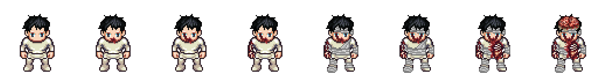

# Personagem com niveis de dano (LPC)

Personagem top-down de 4 direcoes montado camada a camada a partir do
[Universal LPC Spritesheet Character Generator](https://liberatedpixelcup.github.io/Universal-LPC-Spritesheet-Character-Generator/),
com as camadas de ferimento do projeto LPC empilhadas para formar 8 niveis de dano
progressivos do **mesmo** personagem.



Licenca: **CC-BY-SA 3.0** (veja [CREDITS.md](CREDITS.md) — creditar e obrigatorio).

- Corpo `male`, frame de **64x64** px.
- Cada PNG e um sheet de uma animacao: colunas = frames, linhas = direcao.
- Ordem das linhas: **up, left, down, right** (cima, esquerda, baixo, direita).
- `hurt` (morte/queda) tem uma linha so.
- `manifest.json` tem colunas/linhas/tamanho de cada animacao, pronto para ler no codigo.

Cada pasta `damage_N/` tem o personagem com as feridas acumuladas ate aquele nivel.
O nivel 4 em diante inclui **bandagens no torso**, que no LPC existem apenas nas
animacoes classicas — por isso `run` e `jump` so aparecem nos niveis 0-3.

| nivel | o que aparece | animacoes |
|---|---|---|
| `damage_0` | Intacto | `walk`, `run`, `hurt`, `jump` |
| `damage_1` | Boca sangrando | `walk`, `run`, `hurt`, `jump` |
| `damage_2` | + olho direito sangrando | `walk`, `run`, `hurt`, `jump` |
| `damage_3` | + braco ferido | `walk`, `run`, `hurt`, `jump` |
| `damage_4` | + torso enfaixado | `walk`, `hurt` |
| `damage_5` | + olho esquerdo | `walk`, `hurt` |
| `damage_6` | + costelas expostas | `walk`, `hurt` |
| `damage_7` | + cranio aberto | `walk`, `hurt` |

| animacao | frames por direcao | tamanho do sheet |
|---|---|---|
| `walk` | 9 | 576x256 |
| `run` | 8 | 512x256 |
| `hurt` | 6 | 384x64 |
| `jump` | 5 | 320x256 |

- No gerador, as feridas de **braco** e **costelas** tem `zPos` 15, ou seja ficam
  *debaixo* da roupa e nao apareceriam. Aqui foram subidas para 112 para o ferimento
  ficar visivel sobre a camisa.
- A ferida de **cranio aberto** tem `zPos` 115, abaixo do cabelo (120); foi subida
  para 125 para aparecer.
- As bandagens ficam em 110, abaixo das feridas, entao as costelas expostas aparecem
  "sangrando atraves" da bandagem.
- `run` e `jump` dos niveis 0-3 sao identicos aos que o gerador produz para o corpo
  base: as feridas usadas nesses niveis existem para essas animacoes.

O script `tools/build_lpc_character.py` (na raiz do repo) baixa tudo de novo e
remonta os sheets. Para trocar roupa, cabelo, tipo de corpo ou a escada de niveis,
edite as constantes `DEFS`, `BASE`, `TIERS` e `MAX_TIER_MOBILE` no topo do arquivo e rode:

```bash
python3 tools/build_lpc_character.py livrejam/public/assets/character
```

Depois regenere creditos e README:

```bash
python3 tools/gen_lpc_credits.py livrejam/public/assets/character
```

Para explorar outras pecas (armaduras, capas, chapeus, proteses, tapa-olho), use o
gerador no navegador e procure o caminho da peca em `sheet_definitions/` do repo do LPC.
Peças brancas/cinza (capas, por exemplo) precisam ser recoloridas pelo gerador —
os PNGs crus vem na paleta neutra.
